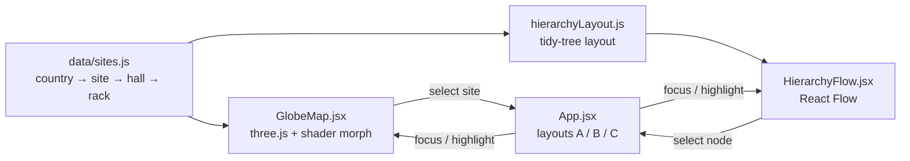

# Global Data Center Explorer

**English** · [中文](#中文)

A demo for browsing data centers spread across many countries. A WebGL globe **unfolds into a flat map** in one continuous animation, and a React Flow graph drills into each site: **country → site → hall → rack**.

All data is invented.

**Live demo:** https://shueny.github.io/geo-hierarchy-flow/

## Features

- **3D globe ↔ 2D map.** A single mesh morphs between a sphere and a plane in the vertex shader, so switching modes is an unfolding animation rather than a swap between two maps. Markers and labels ride the same surface.
- **Three layouts**, switchable from the top bar (also `?layout=B` / `?layout=C` in the URL):
  - **Map + panel** (default): pick a site on the map; its halls and racks open in a side graph.
  - **Drill-down**: the camera flies to the site, then the view becomes that site's graph.
  - **Graph first**: a global hierarchy graph with a mini globe as navigator; selection syncs both ways.
- **3D data hall**: click a hall in any graph to walk into it — raised floor with 600 mm tiles, hot/cold aisles with perforated tiles and a glass containment roof, cooling units, PDUs and overhead cable trays. Walls cut away automatically toward the camera.
- **3D hall ↔ 2D floor plan**: one toggle switches the hall between the 3D scene and a React Flow floor plan of the same layout (tiles, cold aisle, cooling, PDUs, door, each rack's front edge). Both edit the same layout, so a rack moved in one view is already moved in the other.
- **Rotate the whole room**: in 3D, drag anywhere — floor or racks — to orbit the room; right-drag pans, scroll zooms.
- **Movable racks**: in 3D turn on **Move racks** (then dragging a rack moves it and the camera holds still; dragging the floor still orbits); in 2D just drag. Either way, drag a rack to another tile (it snaps to the grid and turns red where it doesn't fit), press **R** to rotate it 90°. Collisions with racks, cooling units, PDUs and walls are blocked. The layout is saved per hall in the browser; **Reset layout** restores the default plan.
- **Rack details**: click a rack to see U usage, power, device count and status; colour racks by status or by U usage; switch between 3D and top view.
- **中文 / English** toggle. The choice is remembered in the browser.

## Run it

```bash
npm install
npm run dev       # http://localhost:5173
npm test          # unit tests (vitest)
npm run build     # static site in dist/
npm run verify:hall   # drives the 3D hall in a real browser (build first; see CLAUDE.md)
```

## How it works



- **Morph.** The mesh is a 256×128 grid whose `uv` is (longitude, latitude). The vertex shader computes the sphere position `s` and the plane position `p = (lon, lat, 1)` and outputs `mix(s, p, uMorph)`. `globeMath.js` mirrors the same formula in JavaScript so markers stay on the surface.
- **Borders.** Natural Earth 110m (from `world-atlas`) is drawn into a 4096×2048 equirectangular canvas used as the texture. Rings that cross the antimeridian (Russia, Fiji) are unwrapped first. Otherwise they fill as a band across the whole map.
- **3D hall.** Built with [react-three-fiber](https://r3f.docs.pmnd.rs/) through its `createRoot` API, so only the three.js classes the scene uses are bundled (`hall3d/SlimCanvas.jsx`, `hall3d/elements.js`). The globe stays on plain three.js. Why, with measurements and the pitfalls found: [`docs/decisions/0001-react-three-fiber-for-3d-scenes.md`](docs/decisions/0001-react-three-fiber-for-3d-scenes.md).
- **Hall floor plan.** `hallLayout.js` is pure logic in tile units: the default hot/cold aisle plan, rack footprints (1 × 2 tiles, 2 × 1 when turned), collision checks and restoring a saved layout as a set (so swapped racks restore correctly). `HallScene.jsx` (three.js) and `HallFlow.jsx` (React Flow, node position = tile × 44 px) only draw it and turn drags into "move rack to tile" requests, so the two views can never disagree. Drags are computed on the plane of the rack tops, so the part you grabbed stays under the cursor.
- **Graph layout.** Four fixed levels with fixed node widths, so a small hand-written tidy tree replaces dagre/elk. Racks wrap into a 4-column grid under their hall.

## Deploy

`.github/workflows/deploy.yml` tests, builds and publishes to GitHub Pages on every push to `main`. Turn it on once under **Settings → Pages → Source: GitHub Actions**. The build uses relative paths (`base: "./"`), so it works from any sub-path or static host.

## Known limits

- Nearby sites overlap at world zoom (the two Taipei sites are ~15 km apart). Clustering would fix it.
- Singapore is too small to have a polygon in the 110m dataset, so it isn't tinted.
- The globe needs WebGL. Without it, the map shows a message and the graph views still work.

## Credits

Country borders: [Natural Earth](https://www.naturalearthdata.com/) via [world-atlas](https://github.com/topojson/world-atlas). Built with [three.js](https://threejs.org/), [React Flow](https://reactflow.dev/) and [Vite](https://vite.dev/).

## License

[MIT](LICENSE)

---

## 中文

一個跨國機房據點的瀏覽 demo：WebGL **地球儀可以連續攤平成 2D 地圖**，再用 React Flow 往下鑽：**國家 → 據點 → 機房 → 機櫃**。所有資料都是虛構的。

**線上 demo：** https://shueny.github.io/geo-hierarchy-flow/

### 功能

- **3D 地球 ↔ 2D 平面**：同一個 mesh 在 vertex shader 裡於球面與平面間插值，切換是攤平動畫，不是換一張圖；標記與標籤跟著地表一起變形。
- **三種版面**（右上切換，也可用網址 `?layout=B`／`?layout=C`）：
  - **地圖＋側欄**（預設）：點地圖上的據點，右側用圖譜展開機房與機櫃。
  - **下鑽換景**：鏡頭先飛到據點，再整頁換成該據點的圖譜。
  - **圖譜為主**：全球層級圖譜為主，右上小地球導覽，兩邊選取互相同步。
- **3D 機房**：在任何圖譜上點「機房」就進入 3D 機房——600 mm 高架地板、冷熱通道（有孔地板＋玻璃頂封閉冷通道）、空調機、PDU、上方走線架；朝向鏡頭的牆會自動剖開。
- **3D 機房 ↔ 2D 平面圖**：一個切換鍵在 3D 場景與 React Flow 平面圖之間切換，平面圖畫的是同一份配置（地板格、冷通道、空調、PDU、門、每座機櫃的正面）。兩邊改的是同一份資料，在一邊移動的機櫃，切到另一邊已經在新位置。
- **整個機房可用滑鼠旋轉**：3D 時拖曳任何地方（地板或機櫃）都是旋轉整個機房；右鍵拖曳平移、滾輪縮放。
- **機櫃可以移動**：3D 時先開啟「移動機櫃」（這時拖曳機櫃是移動、鏡頭不動，拖曳地板仍可旋轉）；2D 直接拖曳。拖曳機櫃到其他地板格（自動對齊，放不下會變紅），按 **R** 旋轉 90°；會擋下撞到機櫃、空調、PDU 或牆壁的位置。配置依機房存在瀏覽器，「還原配置」回到預設。
- **機櫃明細**：點機櫃看 U 使用、功率、設備數、狀態；機櫃可依狀態或 U 使用率上色；3D 與俯視切換。
- **中文／English** 切換，瀏覽器會記住上次的選擇。

### 執行

```bash
npm install
npm run dev       # http://localhost:5173
npm test          # 單元測試（vitest）
npm run build     # 靜態網站輸出到 dist/
npm run verify:hall   # 用真實瀏覽器操作 3D 機房（先 build，細節見 CLAUDE.md）
```

### 技術決策

3D 機房用 react-three-fiber（透過 `createRoot` API，只打包用到的 three.js 類別）；地球儀維持原生 three.js。原因、量測數字與踩到的坑記在 [`docs/decisions/0001-react-three-fiber-for-3d-scenes.md`](docs/decisions/0001-react-three-fiber-for-3d-scenes.md)。

### 部署

推上 `main` 後，GitHub Actions 會跑測試、建置並發佈到 GitHub Pages。第一次要到 **Settings → Pages → Source** 選 **GitHub Actions**。

### 已知限制

- 世界視角下相近的據點會重疊（台北兩個據點相距約 15 公里），之後可加群聚。
- 新加坡在 110m 資料集裡沒有多邊形，所以不會上色。
- 地球儀需要 WebGL；不支援時地圖區會顯示說明，圖譜檢視照常可用。

### 授權

[MIT](LICENSE)
