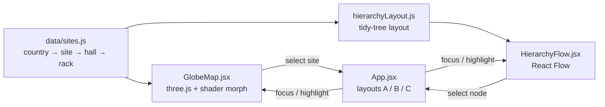

# Global Data Center Explorer

**English** · [中文](#中文)

A demo for browsing data centers spread across many countries. A WebGL globe **unfolds into a flat map** in one continuous animation, and a React Flow graph drills into each site: **country → site → hall → rack**.

All data is invented.

## Features

- **3D globe ↔ 2D map.** A single mesh morphs between a sphere and a plane in the vertex shader, so switching modes is an unfolding animation rather than a swap between two maps. Markers and labels ride the same surface.
- **Three layouts**, switchable from the top bar (also `?layout=B` / `?layout=C` in the URL):
  - **Map + panel** (default): pick a site on the map; its halls and racks open in a side graph.
  - **Drill-down**: the camera flies to the site, then the view becomes that site's graph.
  - **Graph first**: a global hierarchy graph with a mini globe as navigator; selection syncs both ways.
- **Rack details**: click a hall or rack to see U usage, power, device count and status.
- **中文 / English** toggle. The choice is remembered in the browser.

## Run it

```bash
npm install
npm run dev       # http://localhost:5173
npm test          # unit tests (vitest)
npm run build     # static site in dist/
```

## How it works



- **Morph.** The mesh is a 256×128 grid whose `uv` is (longitude, latitude). The vertex shader computes the sphere position `s` and the plane position `p = (lon, lat, 1)` and outputs `mix(s, p, uMorph)`. `globeMath.js` mirrors the same formula in JavaScript so markers stay on the surface.
- **Borders.** Natural Earth 110m (from `world-atlas`) is drawn into a 4096×2048 equirectangular canvas used as the texture. Rings that cross the antimeridian (Russia, Fiji) are unwrapped first. Otherwise they fill as a band across the whole map.
- **Graph layout.** Four fixed levels with fixed node widths, so a small hand-written tidy tree replaces dagre/elk. Racks wrap into a 4-column grid under their hall.

## Deploy

`.github/workflows/deploy.yml` tests, builds and publishes to GitHub Pages on every push to `main`. Turn it on once under **Settings → Pages → Source: GitHub Actions**. The build uses relative paths (`base: "./"`), so it works from any sub-path or static host.

## Known limits

- Nearby sites overlap at world zoom (the two Taipei sites are ~15 km apart). Clustering would fix it.
- Singapore is too small to have a polygon in the 110m dataset, so it isn't tinted.
- The globe needs WebGL. Without it, the map shows a message and the graph views still work.

## Credits

Country borders: [Natural Earth](https://www.naturalearthdata.com/) via [world-atlas](https://github.com/topojson/world-atlas). Built with [three.js](https://threejs.org/), [React Flow](https://reactflow.dev/) and [Vite](https://vite.dev/).

## License

[MIT](LICENSE)

---

## 中文

一個跨國機房據點的瀏覽 demo：WebGL **地球儀可以連續攤平成 2D 地圖**，再用 React Flow 往下鑽：**國家 → 據點 → 機房 → 機櫃**。所有資料都是虛構的。

### 功能

- **3D 地球 ↔ 2D 平面**：同一個 mesh 在 vertex shader 裡於球面與平面間插值，切換是攤平動畫，不是換一張圖；標記與標籤跟著地表一起變形。
- **三種版面**（右上切換，也可用網址 `?layout=B`／`?layout=C`）：
  - **地圖＋側欄**（預設）：點地圖上的據點，右側用圖譜展開機房與機櫃。
  - **下鑽換景**：鏡頭先飛到據點，再整頁換成該據點的圖譜。
  - **圖譜為主**：全球層級圖譜為主，右上小地球導覽，兩邊選取互相同步。
- **機櫃明細**：點機房或機櫃，看 U 使用、功率、設備數、狀態。
- **中文／English** 切換，瀏覽器會記住上次的選擇。

### 執行

```bash
npm install
npm run dev       # http://localhost:5173
npm test          # 單元測試（vitest）
npm run build     # 靜態網站輸出到 dist/
```

### 部署

推上 `main` 後，GitHub Actions 會跑測試、建置並發佈到 GitHub Pages。第一次要到 **Settings → Pages → Source** 選 **GitHub Actions**。

### 已知限制

- 世界視角下相近的據點會重疊（台北兩個據點相距約 15 公里），之後可加群聚。
- 新加坡在 110m 資料集裡沒有多邊形，所以不會上色。
- 地球儀需要 WebGL；不支援時地圖區會顯示說明，圖譜檢視照常可用。

### 授權

[MIT](LICENSE)
